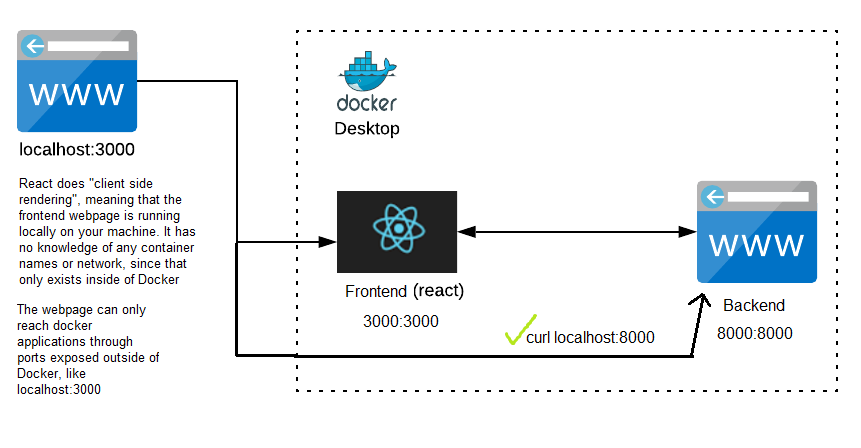
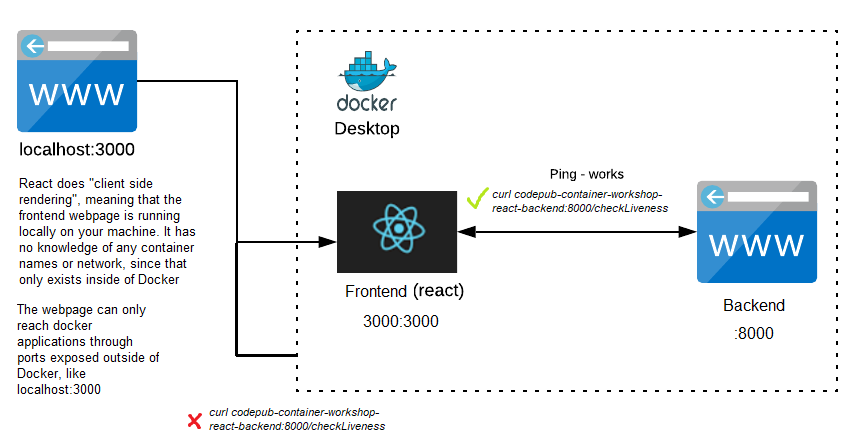
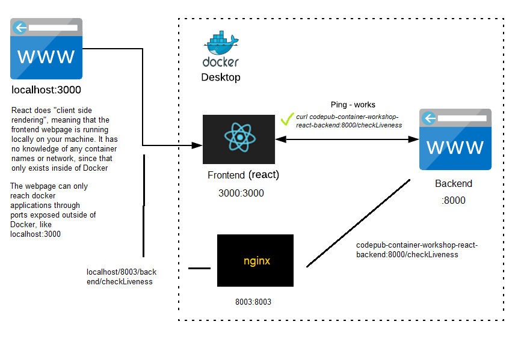

# Part 3: Add a Proxy Server

Even though the static backend did not provide a very useful recipe we should adapt our application to accomodate for the users that would want to still use the old Backend. Since, as you probably noticed, the OpenAI backend is not the fastest to respond (takes around 20 seconds...), also the API key has limitations and might be used up.

In this final part, we will therefore extend our Docker Compose configuration to include both the static and the OpenAI backend services. To distribute traffic between the two backends we will add another service, a _Proxy Server_ to ensure higher application security.

## What is a Proxy Server

A proxy server acts as an intermediary between clients and servers, forwarding requests from clients to servers and returning responses back to the clients. It functions as a gateway, providing various benefits such as improved security, performance optimization, and caching.

Proxy servers have several benefitial use areas in rela world projects. Such as, load balancing and security:

- **Load Balancing**: Proxy servers can distribute incoming requests across multiple backend servers, balancing the workload and ensuring efficient utilization of resources. This helps to improve the scalability and availability of the application.

- **Security**: Proxy servers can act as a barrier between clients and servers, providing an additional layer of security. They can filter incoming requests, block malicious traffic, and enforce security policies, protecting the backend servers from potential attacks.

- **Other benefts/use areas**: Caching, anonymity and privacy.

## Balance traffic between Backends

First things first, we need to update out configuration to now include both backends. So, let's start with uncommenting the static backend in our `docker-compose.yml` file. Make sure to use different host ports for the two backends, i.e. they cannot both use port 8000 on your host computer. You could for instance assign port `8080` to the openAI backend.

Let's re-build and see what we are working with - `docker compose up --build`

As you probably guessed, clicking "_Get recipe_" retrives a response from the backend you allowed to keep the 8000 port. We want the user to be able to choose which backend to use so lets start off by adding a button that fetches from the other backend.

### Task 3.1

To add a button we need to expand the code currently placed within the `App.tsx` file within our frontend (_/applications/frontend/App.tsx_). How you adapt the getRecipe function (either throguht props or by creating a copy) is up to you, but we need to make it so that the two buttons fetch data from one backend each.

<details>
<summary>✅ Solution</summary>
This task could be solved in different ways, so if you managed to get it working with two buttons that each requests their respective backends than you have succeeded.

But, if you would like to see one potential way of solving this we have shared our solution bellow.

```js
...

 async function getRecipe2() {
    setLoading(true);
    const requestBody = JSON.stringify({
      ingredients: ingredients,
    });
    await fetch("http://localhost:8080/recipes", {
      method: "POST",
      headers: {
        "Content-Type": "application/json",
      },
      body: requestBody,
    })
      .then((response) => response.json())
      .then((data) => setRecipe(data))
      .finally(() => setLoading(false));
  }

...

<Button onClick={getRecipe}>Get Recipe</Button>
<Button onClick={getRecipe2}>Get Smart Recipe</Button>

...
```

</details>

Now you have managed to setup the frontend to make use of both of the containerized backends. Up until this point we have containerized three apllications that all are exposed to your host computer through the port mappings you defined in your compose file. This setup is all well and good for development for hosting your setup locally. But in some cases some applications require higher security with least privilege principle when it comes to access.

So, what if you did not want to expose your applications to your host computer but rather make them run seamlessly together and communicate within the multi-container orhcestration?

To visualize this is how your applications communicate at this point:



As you can see your applications rely on communicating across your host computers network. To make the containers communicate within the compose setup we need to adjust our current configurations.

To securely isolate and make our appplications independent from localhost you can remove the host part from the port mappings in our configuration. Currently we have configured mappings like this: `<host-port>:<container-port>`. If we remove the `<host-port>` part we only expose the container port to the compose orchestration, and not to your host computer.

### Task 3.1

Remove the the port outside of the compose network from your compose configuration. I.e. the ports that expose your applications to localhost.

<details>
<summary>✅ Solution</summary>

```yml
---
python-backend:
  container_name: codepub-container-workshop-react-backend
  build:
    dockerfile: backend.dockerfile
    context: applications/backend/
  ports:
    - ":8000"
  networks:
    - mynet
python-frontend:
  container_name: codepub-container-workshop-react-frontend
  build:
    dockerfile: dockerfile
    context: applications/frontend/
  ports:
    - ":3000"
  networks:
    - mynet
openapi-bakend:
  container_name: codepub-container-workshop-openai-backend
  build:
    dockerfile: backend-openai.dockerfile
    context: applications/backend-openai/
  ports:
    - ":8080"
  networks:
    - mynet
---
```

</details>

If you try running your compose setup now what happens? As you probably realized since you no longer expose any ports to your host computer you are not able to access any of the applications through your browser. They are now secured but it is hard to work with applications you are not able to reach.

To visualize, this is what the current state of your setup looks like:



Now that the ports are only exposed within the compose setup,why dont you try to see if they can communicate or reach eachother.

### Task 3.2

Try to ping the backend endpoint `/checkLiveness` from the terminal of your containerized frontend application.

<details>
<summary>✅ Solution</summary>
This can be achieved in two ways. Entering the temrinal through the container in `Docker Desktop`, or entering the throgugh terminal commands.

- Enter the frontend through terminal:

  1.  Use `docker exec -it <container_id/conainer_name> sh`.
      - `docker exec` is used to execute a command inside a running container.
      - `-it` is a combination of two options. `-i` allows you to interact with the container by providing inout to the command being executed, and `-t` stands for _terminal_
      - `sh`is the command that will be executed inside the container. `sh` refers to the Uinx shell.
  2.  Use ping the backend or use curl to reach the `/checkliveness` endpoint.
      - To use `curl` you need to install it within the container - `apk add curl`. Then run `curl container-name:8000/checkLiveness`.
      - If using ping, simply run `ping container-name:8000`

- Enter the frontend throuhg `Docker Desktop``
  1. Open Docker Desktop. Locate and click on the container running your frontend.
  2. Click on the `terminal` tab and execurte step 2 above.
  </details>

Did it work? probably not. At this point each container exposes their ports but in order to be able to successfully communicate we need to setup a network and instruct our applications to communicate through that network. So, lets do that.

### Task 3.3

Add a network to your compose file, and add that network to all applications. Network configurations follow this template:

```yml
networks:
  network-name: # Sets the name of the network. Used as reference within the services.
    driver: # Specifies the network driver to use for the network. It determines how containers in the network communicate with each other.
```

Such a network can be added to a service by referncing the network-name in the `networks` part of the service. You can do this in the same manner as you did with ports.

<details>
<summary>✅ Solution</summary>

```yml
version: "3"
services:
  python-backend:
    container_name: codepub-container-workshop-react-backend
    build:
      dockerfile: backend.dockerfile
      context: applications/backend/
    ports:
      - "8000:8000"
    networks:
      - mynet
  python-frontend:
    container_name: codepub-container-workshop-react-frontend
    build:
      dockerfile: dockerfile
      context: applications/frontend/
    ports:
      - "3000:3000"
    networks:
      - mynet
  openapi-bakend:
    container_name: codepub-container-workshop-openai-backend
    build:
      dockerfile: backend-openai.dockerfile
      context: applications/backend-openai/
    ports:
      - "8080:8080"
    networks:
      - mynet

networks:
  mynet:
    driver: bridge
```

</details>

To verify that the applications can reach eachother you can enter the terminal within the frontend application's container and try to ping the backend again ([Task 3.2](#task-32)).

As you could see the containers are now connected within the compose setup. But, we want to bea ble to see or frontend as we did previously, so we need to make it reachable from localhost.

So, lets make your applications reachable without compromising too much on security. For this we will add a _Proxy Server_ using `nginx`.

<details>
<summary>What is nginx? 🤔</summary>

`nginx` is a popular web server and reverse proxy server that excels at handling high concurrent connections and efficiently managing network traffic. It can be used as a reverse proxy to receive requests from clients and forward them to appropriate backend servers. This is what we will be using it for, to route requests to specific backends. When used as a proxy, `nginx` recieves request from your localhost client and acts as an intermediary towards the three containerized applications.

</details>

**TODO add nginx part with description and tasks **

This is how your final setup looks like.


Congratulations! You have now learned about and compleated the Docker Compose workshop! We hope you learned something new ansdexiting, and had fun doing so!
